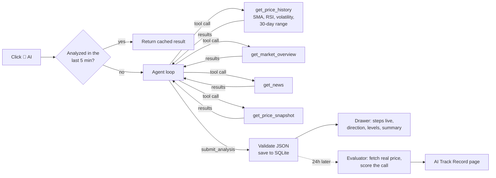

# go-crypto

A desktop crypto market tracker with a **tool-calling AI agent** that analyzes coins and **scores its own predictions** against the real price 24 hours later.

Built with Go, Wails v2, and Vue 3 + Naive UI. Inspired by [go-stock](https://github.com/ArvinLovegood/go-stock).

<!-- TODO: add a GIF of the AI analysis drawer and the AI Track Record page -->

## Features

| | |
|---|---|
| 📋 **Watchlist** | Track coins; prices refresh on a schedule you set |
| 🤖 **AI Analysis** | An agent pulls price history, market data and news through tools, then returns a structured 24h call: direction, confidence, support, resistance, summary |
| 🎯 **AI Track Record** | Every call is checked against the real price 24h later. Accuracy by direction, and confidence on right vs. wrong calls |
| 📊 **Market Overview** | Total market cap, BTC dominance, top 50 coins |
| 🔔 **Price Alerts** | High/low targets. An alert fires once, then pauses until you resume it |
| 📰 **News** | Latest crypto headlines |
| ⚙️ **Settings** | Any OpenAI-compatible LLM (OpenAI, DeepSeek, Ollama…), currency (USD/EUR/CNY/BTC), refresh interval |

## How the agent was built

This started as a Wails desktop app with a plain "ask the LLM for a take" button. Getting it to the tool-calling, self-scoring agent described below went through a few deliberate stages:

1. **Start from the failure mode, not the framework.** A single free-text prompt to an LLM about a coin produces something that *reads* confident regardless of whether it's right. Before writing any agent code, the design question was: what would make this useful rather than decorative? That led to two constraints that shaped everything else — the model should never see numbers it didn't get from a tool call (no hallucinated prices or indicators), and every call it makes should be checked against reality later. Those two constraints are why this isn't a chatbot wrapper: they force a tool-calling loop with structured output and a scoring pipeline, not just a prompt.
2. **Write the agent loop by hand instead of pulling in a framework.** With just one model provider pattern (OpenAI-compatible chat completions) and one job (call tools, then force a structured final answer), a framework would have added indirection without solving anything a ~150-line loop (`backend/agent`) doesn't already handle — see [How the AI analysis works](#how-the-ai-analysis-works) below for what that loop actually does. Keeping it in the standard library also meant it could be unit-tested against a fake local HTTP server instead of mocking a framework's internals.
3. **Push correctness out of the prompt and into code.** Early iterations asked the model to also compute trend and support/resistance from raw numbers — it would get arithmetic wrong in ways that were hard to catch from the outside. Technical indicators (SMA, RSI, volatility) moved into Go (`backend/indicators`, unit-tested), and the model's job narrowed to interpretation only. This is the single change that made the output trustworthy enough to score.
4. **Treat "the AI sounds right" as a claim to verify, not a feature to ship.** The self-scoring evaluator (check the real price 24h after each call) was designed alongside the agent, not bolted on afterward — a track record with 0 scored calls says nothing, so the schema, the storage, and the 24h-later job all shipped together in `backend/analysis`.
5. **Review it like a piece of infrastructure once it worked end-to-end.** Once the happy path worked, a dedicated pass went back through the codebase asking "what breaks under concurrency, rate limits, or bad network conditions?" rather than "does the demo work?" — that pass found and fixed 9 issues that never show up in a quick manual test: a caching layer that silently dropped anything over 4KB, no de-duplication for concurrent identical requests, no backoff after a 429, SQLite writes racing under load, analysis records that could never be scored blocking the whole evaluation queue, a cancel button that didn't actually cancel the in-flight request, ~10KB of debug data shipped to the UI on every history load, stale prices used as an analysis baseline, and duplicate event listeners piling up on every tab switch. Each fix landed with a regression test (`go test ./... -race`) and CI (`.github/workflows`) now runs vet, the full test suite, and a cross-compile on every push, so that class of bug can't silently come back.

## How the AI analysis works



The agent loop (`backend/agent`) is written from scratch on the chat completions API, with no framework:

1. Send the system prompt, the task and the tool definitions to the model.
2. If the model calls tools, run them and send the results back as `tool` messages.
3. Repeat until the model calls `submit_analysis`. On the last allowed round (6), that tool is forced through `tool_choice`, so the loop always ends with structured output.
4. If a tool fails, the error goes back to the model and the loop keeps going. If the model replies in plain text, it is asked once to submit properly.

### Design decisions

- **Code computes, the model interprets.** Moving averages, RSI and volatility are computed in Go (`backend/indicators`, unit-tested) from CoinGecko history. The prompt forbids numbers that did not come from a tool. The first version sent six 24h numbers and asked for "trend and key levels", and the model had to guess.
- **Structured output through a tool.** `submit_analysis` has a JSON Schema. The output is validated in `backend/analysis/core`: the direction enum is normalized, confidence is clamped to 0–1 (a 0–100 answer is converted), and support/resistance are swapped if reversed.
- **Every call is scored.** Every 30 minutes a job checks analyses older than 24h against the price at +24h. If the analysis-time price is more than 5 minutes old, it is re-fetched first, because it is the baseline. Records whose +24h price can't be fetched are retried, and after 6 attempts marked "unscorable", so they never block newer records. The scoring rules:
  - bullish is right if the price rose
  - bearish is right if it fell
  - neutral is right if it moved less than ±1%
  
  This turns "the AI sounds smart" into a number, and shows whether its confidence means anything.
- **Cost and rate limits.** Results are cached for 5 minutes per coin and model. Closing the panel cancels a running analysis, so no more tokens are spent on it. CoinGecko responses are cached in memory for 20s to 10min by a small TTL cache (`backend/data/ttlcache.go`); concurrent requests for the same data share one API call. After an HTTP 429, all CoinGecko calls pause (honoring `Retry-After`) instead of making the limit worse. The evaluator scores at most a few records per run, 3s apart.
- **Live progress without token streaming.** Each tool call is pushed to the UI as a Wails event, so you can watch the agent work.

## Other engineering notes

- **Pure-Go SQLite** (`glebarez/sqlite`, based on `modernc.org/sqlite`): no cgo, no C toolchain. WAL mode plus a 5s busy timeout, because the price refresh, the evaluator and UI actions write concurrently. All timestamps are stored in UTC.
- **Background jobs never pile up.** If a refresh is still running (e.g. slow network), the next tick is skipped instead of queued.
- **API key in the OS keychain** (macOS Keychain, Windows Credential Manager, Linux Secret Service) via `zalando/go-keyring`, never in SQLite. Keys saved by older versions are migrated on startup. On Linux without a keychain, set `GO_CRYPTO_LLM_API_KEY` instead.
- **Currency-safe.** Prices and alerts record their currency. An alert set in EUR is never compared with a USD price, and switching currency clears and re-fetches cached prices.
- **Explicit errors.** CoinGecko HTTP errors, including 429 rate limits, are reported in the UI instead of showing `$0`.
- **Typed frontend.** Components use the Wails-generated TypeScript bindings (`frontend/wailsjs`) rather than `window.go`. Event listeners are cleaned up on unmount.

## Project layout

```
app.go                      Wails-bound methods (the API the UI calls), cron jobs, alerts
backend/agent/              Framework-free tool-calling agent loop (+ tests with a fake LLM server)
backend/analysis/core/      Prompts, output schema, validation, scoring (+ tests)
backend/analysis/service.go Tools wired to real data, caching, evaluator
backend/indicators/         SMA, RSI, volatility, daily resampling (+ tests)
backend/data/               CoinGecko, news, settings/keychain
frontend/src/               Vue 3 + Naive UI
frontend/wailsjs/           Generated bindings (regenerated by `wails dev/build`)
```

## Build

Requirements: Go 1.22+, Node.js 18+, [Wails v2](https://wails.io/docs/gettingstarted/installation)

```bash
go install github.com/wailsapp/wails/v2/cmd/wails@v2.9.0

wails dev          # dev mode with hot reload
wails build        # production binary in build/bin/

go test ./...      # unit tests + SQLite integration tests
```

## AI configuration

In Settings, enter an API key, base URL and model. The model must support **tool/function calling**, for example `gpt-4o-mini`, `deepseek-chat`, or a tool-capable Ollama model such as `qwen2.5` with base URL `http://localhost:11434/v1` (no key needed).

## Data source

[CoinGecko](https://www.coingecko.com/) free public API, no key required. It is rate-limited to a few calls per minute, so the app caches responses.

> For information only. Not financial advice.
